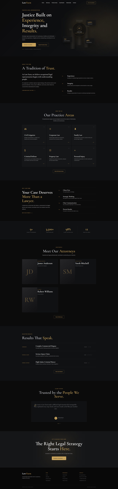
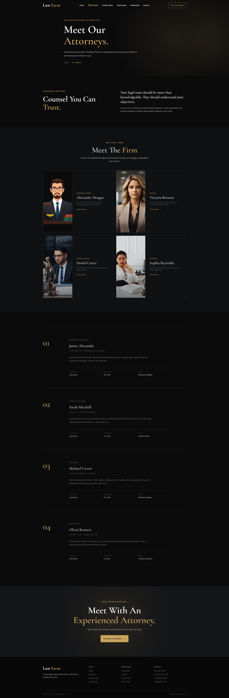
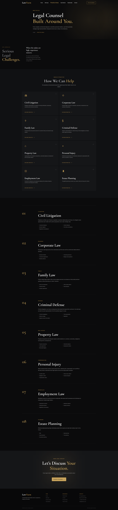
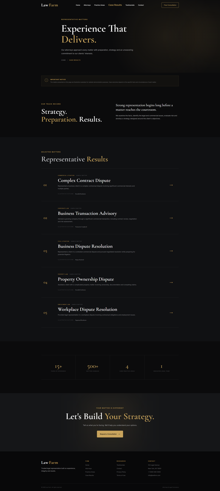
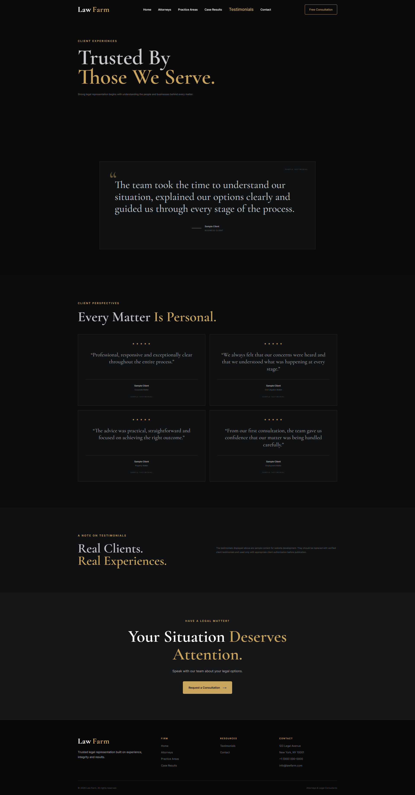
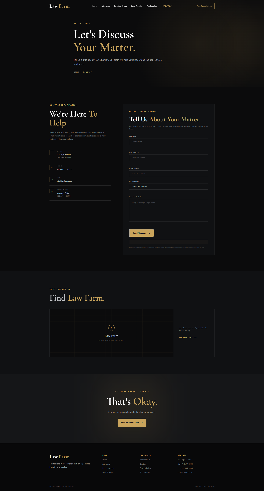

# Law Farm — Modern Law Firm Website

A modern, responsive, and interactive law firm website designed with a sophisticated dark visual identity, elegant typography, smooth animations, and a user-focused interface.

**Law Farm** is being developed as a full-stack legal technology platform, combining a professional law firm website with a planned AI-powered legal information assistant.

> **Project status:** Frontend completed — Backend and RAG system in development.

---

## 📸 Website Preview

### Homepage



### Attorneys



### Practice Areas



### Case Results



### Testimonials



### Contact



---

## ✨ Overview

Law Farm is a modern law firm website focused on establishing **trust, professionalism, authority, and credibility** while giving visitors an intuitive way to explore the firm's services and information.

The frontend combines:

* Sophisticated dark visual design
* Elegant serif typography
* Clean sans-serif body typography
* Subtle animations and transitions
* Responsive layouts
* Clear information hierarchy
* Accessible interaction patterns

The long-term goal is to extend the website into a full-stack legal technology platform with an **AI-powered legal information assistant** backed by a Retrieval-Augmented Generation (RAG) system.

---

## 🎯 Project Goals

The project aims to:

* Create a premium digital presence for a modern law firm
* Present attorneys and practice areas clearly
* Showcase representative case results
* Build visitor trust through testimonials
* Provide an accessible contact and consultation experience
* Deliver a responsive experience across devices
* Maintain a scalable frontend architecture
* Prepare the platform for future AI integration
* Develop an AI assistant capable of providing grounded legal information from an approved knowledge base

---

# 🚀 Current Features

## Frontend

The current frontend includes:

* Responsive desktop, laptop, tablet, and mobile layouts
* Modern dark visual design
* Elegant serif typography for headings
* Readable sans-serif typography for body content
* Responsive navigation
* Active-page navigation states
* Smooth hover interactions
* Scroll-based reveal animations
* Attorney profiles
* Practice area presentations
* Case results
* Client testimonials
* Contact form
* Client-side form validation
* Form submission through Formspree
* Contact-message character counter
* Custom 404 page
* Favicon
* SEO metadata
* `robots.txt`
* XML sitemap
* Semantic HTML
* Accessibility-conscious markup
* Keyboard-friendly interactive elements

---

# 📄 Website Pages

| Page               | Description                                              |
| ------------------ | -------------------------------------------------------- |
| **Home**           | Introduction to the law firm and primary calls to action |
| **Attorneys**      | Attorney profiles and professional information           |
| **Practice Areas** | Overview of the firm's legal practice areas              |
| **Case Results**   | Representative case results and outcomes                 |
| **Testimonials**   | Client testimonials and trust-building content           |
| **Contact**        | Contact form and consultation inquiry                    |
| **404**            | Custom page-not-found experience                         |

---

# 🏗️ Frontend Architecture

The current frontend follows a simple separation between **HTML structure, CSS styling, JavaScript behavior, and visual assets**.

```text
frontend/
│
├── index.html
├── attorneys.html
├── practice-areas.html
├── case-results.html
├── testimonials.html
├── contact.html
├── 404.html
│
├── robots.txt
├── sitemap.xml
│
├── assets/
│   ├── images/
│   └── icons/
│
├── css/
│   └── style.css
│
└── js/
    ├── main.js
    └── contact.js
```

---

# 🛠️ Technology Stack

## Frontend

* HTML5
* CSS3
* JavaScript
* Google Fonts
* Responsive design principles
* CSS animations and transitions

## Form Handling

* Formspree

## Version Control

* Git
* GitHub

---

# 🎨 Design Approach

The visual system is built around a sophisticated, modern legal-industry aesthetic.

### Visual Characteristics

* Dark background
* Elegant accent colors
* High-contrast typography
* Serif display typography
* Clean sans-serif body typography
* Generous spacing
* Minimal visual clutter
* Subtle motion
* Professional interaction states

The design aims to communicate:

**Authority · Trust · Sophistication · Professionalism**

while avoiding an outdated or overly corporate appearance.

---

# 📱 Responsive Design

The website is designed to provide a consistent experience across:

* Desktop
* Laptop
* Tablet
* Mobile devices

Responsive CSS techniques are used to adapt:

* Layouts
* Typography
* Navigation
* Buttons
* Cards
* Forms
* Spacing
* Content presentation

---

# ♿ Accessibility

Accessibility is considered throughout the frontend implementation.

The project includes:

* Semantic HTML
* Proper form labels
* Accessible form feedback
* ARIA attributes where appropriate
* Keyboard-friendly interactive elements
* Visible interaction states
* Screen-reader-conscious markup
* Responsive typography
* Contrast-conscious color choices

The project is being developed with **WCAG principles** in mind.

---

# ⚡ Performance

The frontend is designed with performance in mind.

Current considerations include:

* Lightweight HTML, CSS, and JavaScript
* Optimized visual assets
* CSS-based animations where practical
* Minimal unnecessary JavaScript
* Responsive image handling
* Reduced layout-shifting behavior
* Efficient page structure

---

# 📬 Contact Form

The contact page provides visitors with a structured way to submit a legal inquiry.

### Form Fields

* Full name
* Email address
* Phone number
* Practice area
* Message

### Form Functionality

* Client-side validation
* Character counter
* User feedback
* Legal disclaimer
* Formspree submission

> **Legal notice:** Submitting the contact form does not create an attorney-client relationship.

---

# 🤖 Planned AI Legal Information Assistant

The next major stage of Law Farm is the development of an **AI-powered legal information assistant**.

The planned assistant will use **Retrieval-Augmented Generation (RAG)** to generate responses based on approved legal and firm-specific documents.

The system is intended to help users understand general legal information and navigate the firm's services.

Potential use cases include:

* Identifying which practice area may be relevant to a legal matter
* Identifying attorneys associated with a particular practice area
* Explaining the general area of law related to a legal issue
* Retrieving information from approved firm documents
* Answering general legal-information questions using the approved knowledge base

The assistant will be designed to distinguish **general legal information** from **personalized legal advice**.

---

# 🧠 Planned RAG Architecture

The planned backend architecture follows a Retrieval-Augmented Generation workflow:

```text
                         USER
                           │
                           ▼
                  ┌─────────────────┐
                  │  Chatbot UI     │
                  └────────┬────────┘
                           │
                           ▼
                  ┌─────────────────┐
                  │   FastAPI       │
                  │   Python API    │
                  └────────┬────────┘
                           │
                           ▼
                  ┌─────────────────┐
                  │  RAG Pipeline   │
                  │   LangChain     │
                  └────────┬────────┘
                           │
                           ▼
                  ┌─────────────────┐
                  │    Pinecone     │
                  │ Vector Database │
                  └────────┬────────┘
                           │
                           ▼
                  Relevant Documents
                           │
                           ▼
                  ┌─────────────────┐
                  │     Gemini      │
                  │   LLM / AI      │
                  └────────┬────────┘
                           │
                           ▼
                  Grounded Response
                           │
                           ▼
                         USER
```

---

# 📚 Planned Knowledge Base

The RAG system will be designed to work with approved sources such as:

* PDF documents
* Microsoft Word documents
* Firm information
* Attorney profiles
* Practice-area information
* Legal-information documents
* Internal knowledge documents
* Other approved reference materials

The planned document-processing pipeline will:

1. Ingest approved documents
2. Extract their text
3. Split documents into relevant chunks
4. Generate embeddings
5. Store embeddings in Pinecone
6. Retrieve relevant information for user queries
7. Provide retrieved context to the language model
8. Generate a grounded response

---

# 🔧 Planned Backend Technology

The backend is planned to use Python and will include technologies such as:

* Python
* FastAPI
* LangChain
* Google Gemini API
* Pinecone
* Retrieval-Augmented Generation (RAG)
* Environment-based secret management

Dependency versions will be pinned during backend development to improve compatibility and reproducibility.

---

# 🔐 Security Considerations

Security will be considered throughout backend and AI development.

Planned measures include:

* Environment variables for API credentials
* `.gitignore` protection for secrets
* API-key protection
* Backend-only access to AI provider credentials
* Input validation
* CORS configuration
* Request protection
* Error handling
* Prompt-injection mitigation
* Controlled document retrieval
* Restricted access to approved knowledge sources

> **Important:** API keys, credentials, and other sensitive configuration values must never be committed to the public repository.

---

# 🗺️ Project Roadmap

## Phase 1 — Frontend

* [x] Homepage
* [x] Attorney profiles
* [x] Practice areas
* [x] Case results
* [x] Testimonials
* [x] Contact page
* [x] Contact form
* [x] Responsive design
* [x] Favicon
* [x] SEO metadata
* [x] XML sitemap
* [x] `robots.txt`
* [x] Custom 404 page

## Phase 2 — Backend Environment

* [ ] Python environment
* [ ] Virtual environment
* [ ] Dependency management
* [ ] Environment configuration
* [ ] Gemini API connection
* [ ] Pinecone connection

## Phase 3 — Document Processing

* [ ] PDF ingestion
* [ ] Word document ingestion
* [ ] Text extraction
* [ ] Document chunking
* [ ] Embedding generation
* [ ] Pinecone indexing

## Phase 4 — RAG System

* [ ] Query processing
* [ ] Semantic retrieval
* [ ] Context construction
* [ ] Gemini response generation
* [ ] Source-aware responses
* [ ] RAG evaluation and testing

## Phase 5 — AI Chatbot

* [ ] Chatbot interface
* [ ] FastAPI endpoint
* [ ] Frontend/API integration
* [ ] Conversation handling
* [ ] Error handling
* [ ] Security controls

## Phase 6 — Production

* [ ] Backend deployment
* [ ] Frontend deployment
* [ ] Domain configuration
* [ ] HTTPS
* [ ] Production testing
* [ ] Performance optimization
* [ ] Final accessibility testing

---

# 🧪 Development Philosophy

Law Farm is being developed incrementally, with individual components tested before being integrated into the larger system.

This approach helps identify and resolve issues such as:

* Dependency conflicts
* API errors
* Integration problems
* Retrieval quality issues
* Frontend/backend communication problems
* Deployment issues

Backend dependencies will be version-pinned to support reproducible development environments.

---

# ⚠️ Legal Disclaimer

The planned AI assistant is intended to provide **general legal information** based on its approved knowledge base.

It is **not intended to**:

* Replace a qualified attorney
* Provide personalized legal advice
* Establish an attorney-client relationship
* Create an attorney-client relationship through chatbot interaction

Users should consult a qualified attorney regarding their specific legal circumstances.

---

# 📌 Project Status

| Component             | Status                                           |
| --------------------- | ------------------------------------------------ |
| Frontend              | ✅ Completed — Initial production-ready milestone |
| Backend               | 🚧 In development                                |
| Document Processing   | 📋 Planned                                       |
| RAG System            | 📋 Planned / In development                      |
| AI Chatbot            | 📋 Planned                                       |
| Production Deployment | 📋 Planned                                       |

---

# 👨‍💻 Developer

Law Farm is being developed as a modern full-stack legal technology project combining:

**Professional Web Design + Python Backend + Retrieval-Augmented Generation + AI**

---

# 📄 License

This project is currently maintained as a **private/commercial project**.

**All rights reserved.**
